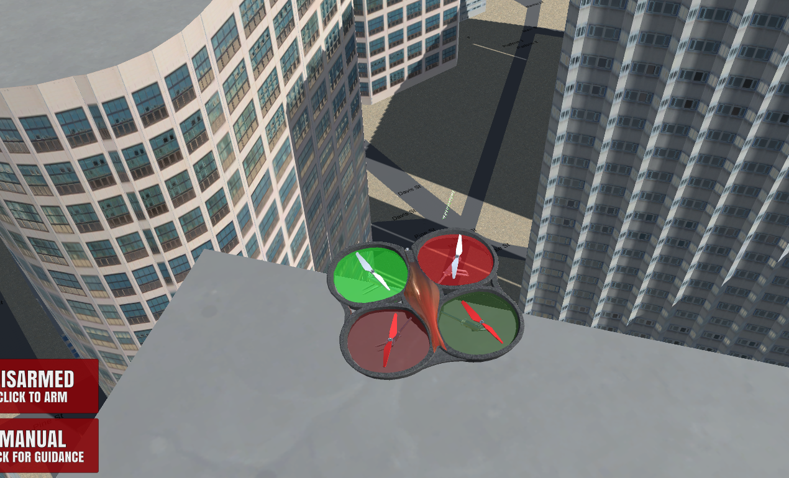
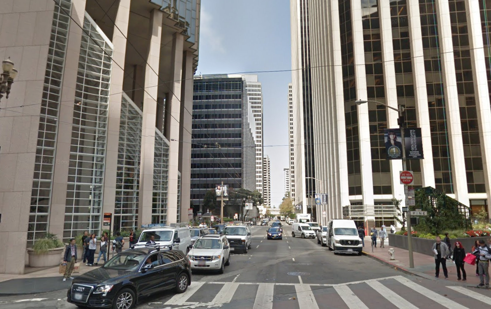
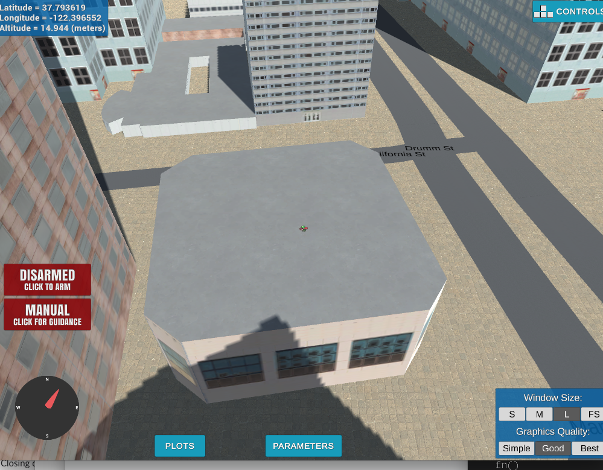

## Project: 3D Motion Planning

---

# Completed these  Steps for Submission:
1. Load the 2.5D map in the colliders.csv file describing the environment.
2. Discretize the environment into a grid or graph representation.
3. Define the start and goal locations.
4. Perform a search using A* or other search algorithm.
5. Use a collinearity test or ray tracing method (like Bresenham) to remove unnecessary waypoints.
6. Return waypoints in local ECEF coordinates (format for `self.all_waypoints` is [N, E, altitude, heading], where the drone’s start location corresponds to [0, 0, 0, 0].
7. Write it up.
8. Congratulations!  Your Done!

## [Rubric](https://review.udacity.com/#!/rubrics/1534/view) Points
### Here I will consider the rubric points individually and describe how I addressed each point in my implementation.  

### Explain the Starter Code

#### 1. Explain the functionality of what's provided in `motion_planning.py` and `planning_utils.py`
These scripts contain a basic planning implementation that includes...

The `motion_planning.py` code is a bit more advanced in the way it executes it commences the execution of
the way points in comparison to the `backyard_flyer.py`. Here are the main differences:

* Unlike the `bacyard_flyer.py` which would fly a square relative to wherever the drone was placed, 
this `motion_planning.py` tries to start the navigation at a preset starting point initially set to map center. 
* If you manually placed the drone arbitrarily, it first does a "line-of-sight" movement to the map center.
* If the drone is able to reach the map-center without hitting obstacles, it then executes a Grid-based
A-Star search and executes a plan to move (+10, +10) meters in the North-East direction.
* This results in a zig-zag path being calculated (because of discretized diagonal motion)
* The drone then executes this path and lands below the target location. 
* Also, care must be taken to not manually place it at altitudes above the `TARGET_ALTITUDE` at the start since the 
starting step is to go to the predefined altitude. In other words if you place the drone on top of a building
corner (from which line of sight to `self.global_home` may exist), the only way to get the drone to fly and do the 
zig-zag pattern (albeit at a very high mid-air location) is by setting the `TARGET_ALTITUDE` > building_top.

For example, I was able to place the drone here, and set a `TARGET_ALTITUDE` to 175 and get the drone to fly to a 
point above map-center and do the zig-zag dance at a high altitude and then land safely.

### Implementing Your Path Planning Algorithm

#### 1. Set your global home position
I used python regular expressions (`import re`) to do this after reading in the first line of the text file
using `file.readline()`. I didn't code any protection for missing/malformed information etc., I assume the format
of the file is valid, etc. I did take care to accomodate negative and non-negative values for lat/long.
I then used the `set_home_position()` to set the home lat/lon.

And here is what Davis and Pine really looks like:

#### 2. Set your current local position
This is accomplished by convert the current global position to a local position using `global_to_local()` and passing
in the `global_home` argument relative to which the local position is calculated in this call.

#### 3. Set grid start position from local position
Offset the `self.local_position` appropriately in (NE - Grid tuple space) to obtain the current grid location.

#### 4. Set grid goal position from geodetic coords
I accomplished this by passing additional fields in colliders.csv with prefixes `lat1` and `lon1` and using regular expressions
as used before to read it from the file. I cast these values to `float64` and then use `global_to_local` to again get the end goal
in local grid co-ordinates. I take care to make sure the grid co-ordinates returned are integers.

#### 5. Modify A* to include diagonal motion (or replace A* altogether)
I decided to use the Vornoi graph extraction approach instead of adding diagonal motion to the grid based approach.
To do this I added the following three methods to `planning_utils.py`:

1. `create_grid_and_edges`: This method extracts Vornoi ridge vertices, and checks for collisions using bresenham and returns a graph (as edges).
2. `extract_graph_start_goal`: This method converts Vornois edges to a graph representation and finds the closest start/goal to nodes.
3. `a_star_g`: This method runs A-Star on a graph.

#### 6. Cull waypoints 
I used bresenham to do the culling, with the option to also do collinearity check if needed. 

### Execute the flight
#### 1. Does it work?
It works for the current setting of global home and target (specified in colliders.csv line 1). 
I haven't done an exhaustive search, but here are some of the problems I found and how I addressed
some of them:

1. The generation of the raw vornoi graph is fast, however checking and eliminating edges is an expensive process and can take 30-45 seconds. To get around this problem I added the ability to pickle a cache for the admissable edges in my program. I realized that the output of the vornoi call is a function of the csv data provided, the `TARGET_ALTITUDE` and `SAFETY_DISTANCE`. I save my cache keyed on the latter, and assume for now that `colliders.csv` is naively static. What this means is that in successive calls to my program I don't have to wait for edges calculation if I am retesting with the same parameters. 
2. The graph generated by the vornoi edges may not be fully connected. So depending on the start and goal a path may or may not exist. I added some protection code in the call to `waypoint_transition` to make sure en empty path is not popped and made sure drone just goes up and comes back done. Ideally it shouldn't even arm. See point 5. below for alternative strategies.
3. There are times where the drone controller will overshoot a way point and if the thresholds are satisfied will make a line of sight attack to the next way-point. This itself might have an obstruction in place. Dynamic obstrucion checking using bresenham or collinearity is something I would have liked to handle. Alternatively maybe doing something dynamic with the thresholds (make it a function of velocity, etc.) might have helped. But more thought needed on that. 
4. I preferred Bresenham over Collinearity for the path pruning as this resulted in less long "L-shaped" zig-zags.
5. I added a loop in my main calculations in `plan_path` to keep trying higher altitudes (at 5m integer intervals) in case a path was not found. This could be either becuase a vehicle was parked high up on a building, or if the graph connectiviy is not good from start to goal at a lower altitude.

### Double check that you've met specifications for each of the [rubric](https://review.udacity.com/#!/rubrics/1534/view) points.
  
# Extra Challenges: Real World Planning

I added a few checks and balances for re-trying etc. But due to limited time I was not able to finish the chapter before this project. I will try to do them sometime later. 

